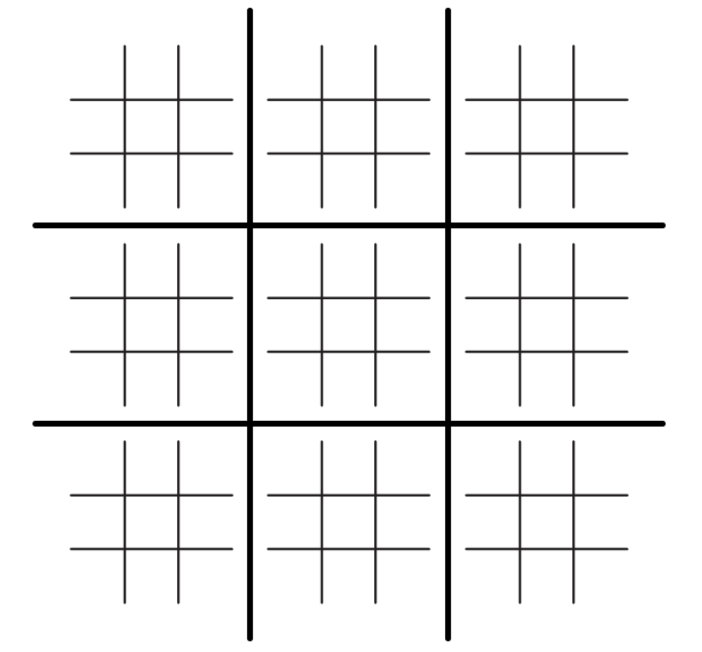

# gato_de_gatos
Primer proyecto de programación para la materia de Inteligencia Artificial, ITAM Otoño 2024.

# Descripción del juego
Esta solución de Inteligencia Arificial se implementa para el juego de "Gato de gatos" o "Ultimate Tic-Tac-Toe". El tablero de este juego tiene una cuadrícula de 9x9, dividida en células más pequeñas de 3x3 como se muestra a continuación:

Los jugadores se turnan para jugar en los gatos más pequeños (células 3x3), colocando una cruz o un círculo en una de las casillas del gato pequeño. Este proceso involucra **dos tipos de 'figuras'** (cruces y círculos) que los jugadores colocan según el turno que sea. Esto continúa hasta que algún jugador gane en el gato grande (cuadrícula 9x9). 

Para ganar uno de los gatos pequeños, se tienen que colocar **tres fichas en línea** de la misma figura. Esta línea se puede conseguir horizontalmente, verticalmente o diagonalmente, y, una vez que se logre este patrón, se coloca una figura grande en esa célula para indicar que ese gato pequeño ha sido ganado por tal figura. 

Es importante mencionar que, en el gato, los empates pueden ocurrir (ningún jugador gana). En este caso, se coloca una 'G' como la figura de la célula para indicar empate (o gato - otro nombre para el empate en este domino). Los empates en las células pequeñas no se considerarán como comodín, sino como una célula muerta que ningún jugador puede reclamar. 

Siguientemente, para ganar el "Gato de gatos" es necesario satisfacer la misma condición en la cuadrícula 9x9 que en las células 3x3. Es decir, algún jugador deberá conseguir **tres fichas 'grandes' en línea** para poder reclamar la victoria. También pueden ocurrir empates en el "Gato de gatos", aunque es menos común que en el juego tradicional.

Finalmente, existe una regla que provoca que el "Gato de gatos" sea un **juego más estratégico** y genera que los jugadores piensen más sus movimientos y no solamente se concentren en las células. Esta regla consiste en algo llamado **movimiento vinculado**, es decir, el movimiento que haces en un gato pequeño determina en cuál de los otros gatos pequeños tu oponente debe jugar su siguiente turno. Por ejemplo, si juegas en la casilla central de un gato pequeño, tu oponente debe jugar en el gato pequeño que ocupa esa posición en la cuadrícula grande (casilla 3x3 central). El flujo del juego se ilustra con la siguiente imágen:

En este caso, el primer jugador colocó una cruz en la esquina superior derecha del gato pequeño central. Por lo que el segundo jugador deberá colocar su círculo en alguna de las casillas del gato pequeño de la esquina superior derecha.

# Ejecución del programa
Al correr, hay que ingresar como parámetro el turno en el que va a jugar la computadora (cruz o cículo). Posteriormente, dependiendo del turno que sea, ingresaremos, como instrucción, la casilla en la que el jugador colocó la ficha **(la máquina siempre tomará la primera jugada como cruz y la segunda como círculo)**. 

De esta forma, la máquina correrá los algoritmos correspondiendtes para determinar en que casilla jugará ella (devolverá el movimiento en el mismo formato de instrucción) y el juego continuará hasta que exista un ganador. Esta instrucción deberá ser ingresada como un par de letras, la primera mayúscula y la segunda minúscula. La primera letra indica en que casilla 3x3 se jugará y la segunda letra indica en que casilla del gato pequeño se colocará la ficha que toca. Por ejemplo, la instrucción 'Ec' indica que se jugará en la casilla central y se colocará una ficha (cruz o círculo) en la esquina superior derecha de ese gato pequeño. La siguiente imagen ilustra la nomenclatura de las casillas:

Cada célula se representa por una letra mayúscula {A-I} y cada casilla de un gato pequeño se representa por un par de letras {A-I}{a-i}.

# Explicación de la solución
La solución consiste en un archivo `.py` que, al ejecutarlo, podemos interactuar, mediante la terminal, para llevar a cabo el juego. Este archivo `.py` llamado `Equipo2.py` no contiene librerías importadas y está basado en la última versión de Python `Python 3.12.3`.

## Clases
#### Nodo
Clase que ayudará a componer el árbol de decisión para posteriormente realizar un algoritmo de Minimax. Esta clase tiene como atributos: hijos, papa, valor (movimiento en el tablero), es_max y es_hoja.

#### Arbol
Clase que compondrá el árbol de decisión a partir de elementos de la clase Nodo para poder realizar un algoritmo de Minimax.

#### Gato
Clase que compone toda la lógica (y funciones) para realizar un juego de gato_de_gatos o "Ultimate Tic-Tac-Toe".

## Funciones
#### calcula_peso_patron(estado_patron, maquina)
Calcula el peso de un patrón de victoria dentro de un gatito (subtablero). Recibe el estado del patrón y si la máquina es X (0) o O (1), y devuelve un peso positivo.

#### calcula_peso_patron_grande(estado_patron, maquina)
Calcula el peso de un patrón de victoria del tablero grande para ponderar los pesos. Similar a calcula_peso_patron, pero para el tablero completo.

#### Gato.decide_jugador(jugador)
Decide si el jugador es X o O. Recibe un número par o impar y devuelve 3 (si es par, X) o 5 (si es impar, O).

#### Gato.suma_tablero(maquina)
Determina una puntuación para el estado actual del tablero. Combina las evaluaciones de todos los subtableros y las relaciones en el tablero grande.

#### Gato.pondera_estados(arreglo_estados, maquina)
Pondera los estados de los subtableros con base en los patrones de victoria del tablero grande.

#### Gato.comodin_tablero(jugador, maquina)
Determina el mejor movimiento en el tablero grande cuando nos han mandado a un subtablero resuelto (comodín).

#### Gato.analiza_tablero(maquina)
Analiza los subtableros y determina los valores de los mismos, basado en los patrones de victoria.

#### Gato.analiza_tablero_comodin(jugador, maquina)
Determina los valores de los subtableros para posteriormente analizar cuál se elegirá, dado que nos envían a un subtablero resuelto (comodín).

#### Gato.genera_arbol(mov, jugador, maquina)
Genera el árbol de decisión para el algoritmo Minimax. Realiza el movimiento recibido del jugador y genera los hijos.

#### Gato._genera_arbol(mov, actual, contador, jugador, maquina, profundidad)
Método privado para generar el árbol de decisión recursivamente, alternando entre los turnos de X y O.

#### Gato.calcular_profundidad(jugador)
Determina la profundidad del árbol basado en el turno actual del juego.

#### Gato._es_gatito_resuelto(letra_mayor)
Determina si un gatito (subtablero) está resuelto.

#### Gato.actualiza_letra_mayor(letra_mayor)
Actualiza el estado de un gatito (subtablero) y determina si está resuelto.

#### Gato.actualiza_tablero()
Actualiza el tablero completo, determinando si cada gatito (subtablero) está resuelto y actualizando su estado.

#### Gato._minimax(nodo, es_max)
Aplica el algoritmo Minimax para determinar el mejor movimiento de la máquina.

#### Gato.juega()
Método principal para jugar el juego del gato_de_gatos. Maneja la interacción con el usuario, muestra el tablero, y coordina los movimientos del jugador y la máquina hasta que el juego termina.
